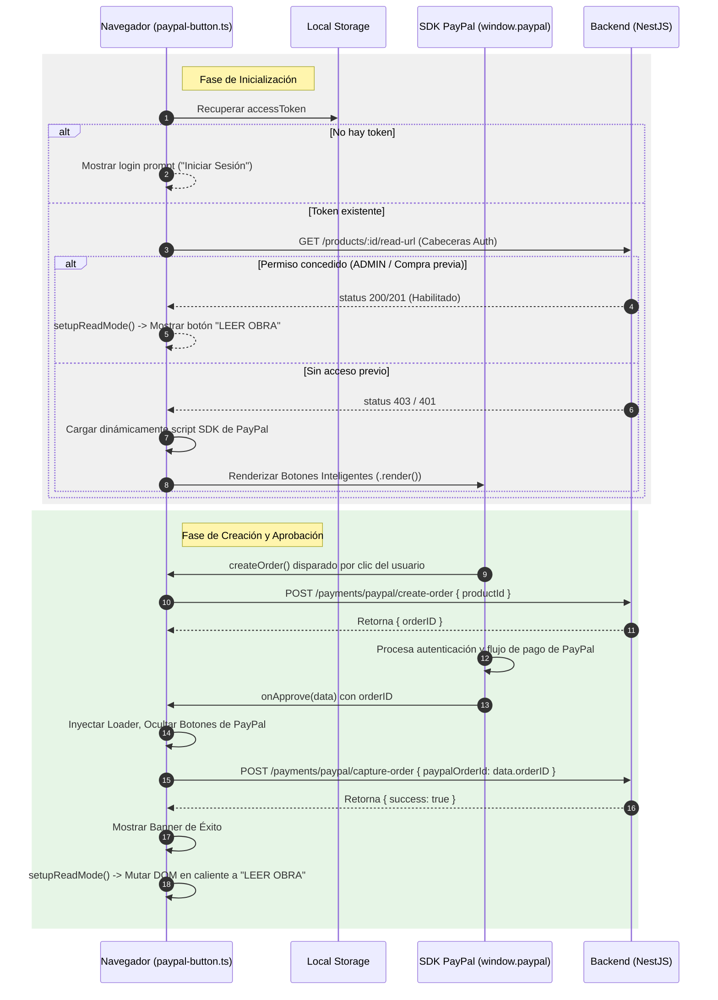

# Élite Educativa Frontend Web App

Este repositorio contiene la aplicación del lado del cliente para la plataforma **Élite Educativa**. Consiste en una interfaz de usuario de alto rendimiento estructurada sobre **Astro** para ofrecer renderizado híbrido y optimización SEO nativa, integrando de forma reactiva el SDK de Botones Inteligentes de **PayPal Sandbox** para procesar cobros y habilitar la lectura de las obras de forma inmediata y en tiempo caliente.

---

## 1. Propósito y Flujo de Interfaz

### Descripción del Proyecto
El frontend actúa como la interfaz de usuario de alto rendimiento para el catálogo digital, combinando la velocidad de carga del renderizado híbrido en el servidor (SSR/SSG) con la interactividad en cliente de scripts reactivos. Orquesta directamente la integración asíncrona del SDK de PayPal en el navegador del usuario para mutar instantáneamente el flujo de adquisición de obras a un modo lectura de visor PDF. Esto mitiga latencias de red y proporciona una experiencia de usuario (UX) fluida y libre de recargas síncronas de página.

### Módulos y Componentes Críticos de la UI

*   **Authentication Flows (`src/pages/login.astro` & `src/services/auth.service.ts`)**: Gestiona la autenticación del usuario mediante formularios dedicados y persiste el ciclo de vida de la sesión a través de los tokens `accessToken` y `activeSessionId` (guardados localmente bajo `accessToken` y `activeSessionId` en `localStorage`), además de la metadata en `elite_user_data`.
*   **PayPal Intelligent Button (`src/components/PayPalPaymentButton.astro` & `src/components/paypal-button.ts`)**: Componente dinámico y desacoplado que actúa como cargador asíncrono del SDK global de PayPal. Renderiza los botones interactivos e implementa los hooks transaccionales del cliente en caliente.
*   **Renderizado Condicional de Obra (`src/pages/libros/[id].astro`)**: Controlador que interactúa con la API del backend mediante peticiones HTTP para consultar los permisos de lectura del usuario (`/products/[id]/read-url`). Decide en tiempo real si expone el módulo de pago de PayPal o renderiza directamente el disparador de lectura ("LEER OBRA") que abre el visor PDF.

---

## 2. Estructura del Proyecto

A continuación, se detalla la estructura física del código fuente dentro del directorio `src/`, explicando la responsabilidad de sus componentes de arquitectura:

```text
src/
├── assets/                     # Recursos gráficos estáticos procesados por Vite
├── components/                 # Componentes visuales reutilizables
│   ├── admin/                  # Componentes específicos del panel de administración
│   ├── ui/                     # Primitivas de diseño atómicas y estructurales
│   ├── BookCard.astro          # Card de presentación de obra en catálogo Astro
│   ├── BookCardReact.tsx       # Componente de catálogo interactivo en React
│   ├── BooksFeatured.astro     # Contenedor estático de obras recomendadas
│   ├── FeaturedBooksList.tsx   # Grid interactivo dinámico de obras destacadas
│   ├── Features.astro          # Sección informativa de características técnicas
│   ├── Footer.astro            # Pie de página global
│   ├── Hero.astro              # Cabecera principal de marketing con alta conversión
│   ├── Navbar.astro            # Menú de navegación principal con estado de sesión
│   ├── PayPalPaymentButton.astro # Wrapper Astro de la pasarela de PayPal
│   ├── paypal-button.ts        # Controlador del ciclo de vida y orquestador del SDK de PayPal
│   └── StatsBar.astro          # Barra estética de métricas y estadísticas
├── layouts/                    # Plantillas HTML base reutilizables
│   └── Layout.astro            # Contenedor base de documentos HTML con metatags SEO
├── pages/                      # Sistema de enrutamiento basado en archivos de Astro
│   ├── libros/
│   │   └── [id].astro          # Ruta dinámica SSR para la ficha de detalle de cada libro
│   ├── 404.astro               # Página de error 404 optimizada
│   ├── index.astro             # Landing page principal
│   ├── libros.astro            # Catálogo general de libros de la biblioteca
│   └── login.astro             # Flujos unificados de Login, Registro y Confirmación
├── services/                   # Clientes de API y persistencia de datos (Singletons)
│   ├── auth.service.ts         # Orquestador de llamadas de sesión y almacenamiento de tokens
│   ├── book.service.ts         # Consumo del catálogo de productos y metadatos
│   └── category.service.ts     # Consumo y filtrado por categorías de libros
├── store/                      # Estados reactivos locales globales
│   └── adminStore.ts           # Store liviana para estados administrativos
├── styles/                     # Estilos globales y configuraciones de diseño
└── utils/                      # Funciones utilitarias y helpers puros
    └── format.ts               # Formateadores de moneda y strings en el cliente
```

> [!NOTE]
> Las interfaces y contratos de comunicación con el backend (como `CaptureOrderResponse`, `CreateOrderResponse` y `ReadUrlResponse`) se definen de forma estricta al inicio del archivo [paypal-button.ts](file:///c:/Users/Personal/Documents/Frontend-cursos/Frontend-plataforma/src/components/paypal-button.ts) para evitar el uso del tipo dinámico `any` y asegurar el tipado fuerte al consumir la API de PayPal.

---

## 3. Guía de Instalación y Despliegue Local

Siga estas instrucciones para clonar, configurar e iniciar el entorno de desarrollo local:

### Paso 1: Instalación de Dependencias
Acceda al directorio raíz del proyecto frontend e instale todos los paquetes necesarios mediante `npm`:

```bash
# Navegar al directorio del frontend
cd Frontend-plataforma

# Instalar dependencias del cliente
npm install
```

### Paso 2: Configuración del Entorno Local
Cree un archivo `.env` en la raíz del directorio `Frontend-plataforma` basándose en el siguiente diccionario. Puede copiar directamente esta estructura:

```bash
# Copiar archivo de ejemplo o crear uno nuevo
cp .env.example .env
```

Asegúrese de definir las variables correspondientes a su entorno local tal como se explica en la siguiente sección.

### Paso 3: Lanzar Servidor de Desarrollo
Inicie el servidor local de desarrollo provisto por Astro:

```bash
# Iniciar servidor Astro
npm run dev
```

El servidor estará disponible en [http://localhost:4321/](http://localhost:4321/).

---

## 4. Diccionario de Variables de Entorno del Cliente

El frontend de Astro utiliza variables de entorno expuestas al cliente (prefijo `PUBLIC_`) para parametrizar las conexiones de red y las claves públicas de pasarelas externas:

| Variable | Descripción | Ejemplo de Valor | Obligatoria (Sí/No) |
| :--- | :--- | :--- | :--- |
| `PUBLIC_API_URL` | Dirección base de la API backend desarrollada bajo NestJS. | `http://localhost:3000` | Sí |
| `PUBLIC_PAYPAL_CLIENT_ID` | Identificador público (Client ID) de la cuenta de Sandbox de PayPal Developer. | `AcUU5pKnN4nlfgIC9K3JmA08...` | Sí |

---

## 5. Arquitectura del Ciclo de Vida del Pago en el Cliente

El controlador asíncrono [paypal-button.ts](file:///c:/Users/Personal/Documents/Frontend-cursos/Frontend-plataforma/src/components/paypal-button.ts) maneja de forma reactiva y secuencial el flujo de transacciones e interacción de componentes sin provocar recargas de la página:



### Fase de Inicialización
1.  **Validación de Sesión:** El controlador lee el almacenamiento local buscando `accessToken`. Si no se encuentra, detiene la carga, oculta el cargador y muestra el botón `paypal-login-prompt` apuntando a `/login`.
2.  **Verificación de Acceso:** Si el usuario tiene sesión activa, el script realiza un `fetch` hacia `${PUBLIC_API_URL}/products/${bookId}/read-url` con cabeceras de autorización.
    *   Si retorna `200` o `201`, ejecuta `setupReadMode()`, ocultando componentes de pago para mostrar únicamente el botón de lectura directa ("LEER OBRA").
    *   Si retorna un código de error de acceso, el script invoca la carga asíncrona de `https://www.paypal.com/sdk/js` inyectando el `PUBLIC_PAYPAL_CLIENT_ID` y procede a renderizar los botones en el contenedor `#paypal-button-mount`.

### Fase de Aprobación (`onApprove`)
1.  **Captura del Evento:** Una vez completada la transacción en el flujo emergente de PayPal, el hook `onApprove` captura el parámetro `data.orderID`.
2.  **Transición de la UI:** Oculta inmediatamente el contenedor de los botones de pago (`#paypal-buttons-container`) e inyecta la animación de carga (`#paypal-loading`) para prevenir reintentos de pago accidentales.
3.  **Confirmación y Mutación:** Realiza una petición POST al endpoint `${PUBLIC_API_URL}/payments/paypal/capture-order` enviando el identificador del pedido bajo el parámetro `paypalOrderId`.
4.  Al recibir la confirmación de éxito (`success: true`), despliega el banner de retroalimentación de compra exitosa (`#paypal-feedback-banner`) y ejecuta la función `setupReadMode()`. Esta muta la UI para habilitar de inmediato el botón de visualización del PDF, todo sin recargar la página.

### Fase de Resiliencia
*   **Gestión de Errores de API:** Si la creación de la orden (`createOrder`) o la captura (`captureOrder`) fallan debido a caídas de conexión, expiración de tokens (HTTP 401) o fallos del lado del servidor NestJS, el sistema de captura de errores captura la excepción e invoca a `showError()`.
*   **Restauración del Estado:** Se muestra un banner explicativo detallando el error y se restauran automáticamente las visualizaciones originales: se oculta el spinner y se vuelve a hacer visible el contenedor de PayPal para que el usuario pueda intentar el cobro nuevamente o seleccionar otro método de pago sin perder su progreso en pantalla.
